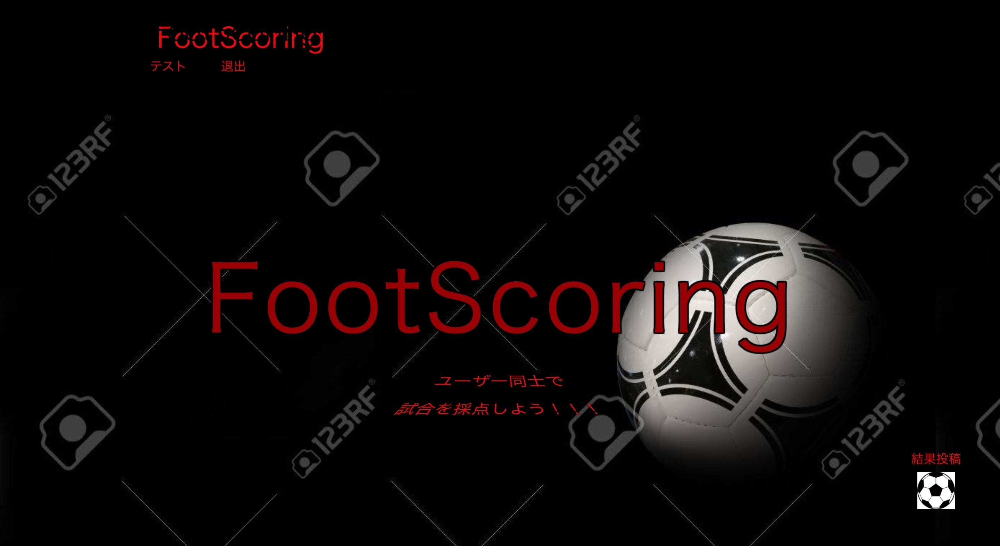

### アプリケーション名

# footscoring

## アプリケーション概要
「サッカーの試合採点共有サイト」です。私はサッカーのニュースを見ることや試合観戦がとても好きです。その際、ニュースで媒体がサッカー選手や試合に採点しているのを見てユーザー同士が試合に採点し共有するのはどうかと考え、このアプリを作成しました。

## 公開先URL: https://scoring-29714.herokuapp.com/

# テーブル設計

## users テーブル

| Column                | Type     | Options     |
| --------------------- | -------- | ----------- |
| nickname              | string   | null: false |
| email                 | string   | null: false |
| encrypted_password    | string   | null: false |

### Association

- has_many :foots
- has_many :reviews

## foots テーブル

| Column         | Type       | Options                        |
| -------------- | ---------- | ------------------------------ |
| ateam          | string     | null: false                    |
| ascore_id      | integer    | null: false                    |
| bteam          | string     | null: false                    |
| bscore_id      | integer    | null: false                    |
| one_member     | string     | null: false                    |
| two_member     | string     | null: false                    |
| three_member   | string     | null: false                    |
| four_member    | string     | null: false                    |
| five_member    | string     | null: false                    |
| six_member     | string     | null: false                    |
| seven_member   | string     | null: false                    |
| eight_member   | string     | null: false                    |
| nine_member    | string     | null: false                    |
| ten_member     | string     | null: false                    |
| eleven_member  | string     | null: false                    |
| aone_member    | string     | null: false                    |
| atwo_member    | string     | null: false                    |
| athree_member  | string     | null: false                    |
| afour_member   | string     | null: false                    |
| afive_member   | string     | null: false                    |
| asix_member    | string     | null: false                    |
| aseven_member  | string     | null: false                    |
| aeight_member  | string     | null: false                    |
| anine_member   | string     | null: false                    |
| aten_member    | string     | null: false                    |
| aeleven_member | string     | null: false                    |
| user           | references | null: false, foreign_key: true |

### Association

- belongs_to :user
- has_many :reviews

## reviews テーブル

| Column         | Type       | Options                        |
| -------------- | ---------- | ------------------------------ |
| content        | string     |                                |
| score          | integer    |                                |
| foot           | references | null: false, foreign_key: true |
| user           | references | null: false, foreign_key: true |

### Association

- belongs_to :user
- belongs_to :foot
